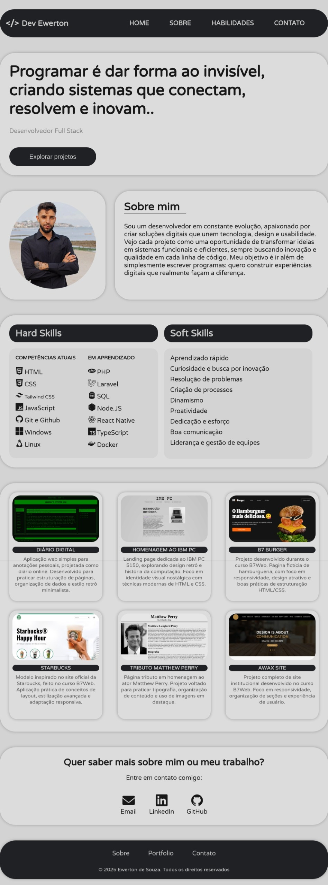

# 🌐 Meu Portfólio

Este é o repositório do meu portfólio pessoal.  
Aqui mostro alguns dos meus projetos e minha evolução como desenvolvedor.

## 🚀 Tecnologias utilizadas
- HTML5
- CSS3
- JavaScript

## 🎨 Objetivo
Criar um site responsivo e moderno para apresentar meus projetos e facilitar o contato.

## 🔗 Acesse meu portfólio
(Se ativar o GitHub Pages depois, coloca o link aqui!)  
👉 [Meu Portfólio Online](https://dev-ewerton.vercel.app/)

## 📷 Preview

## 📬 Contato
- GitHub: [@SirSouza](https://github.com/SirSouza)
- Email: ewertoncomdabliu@proton.me
